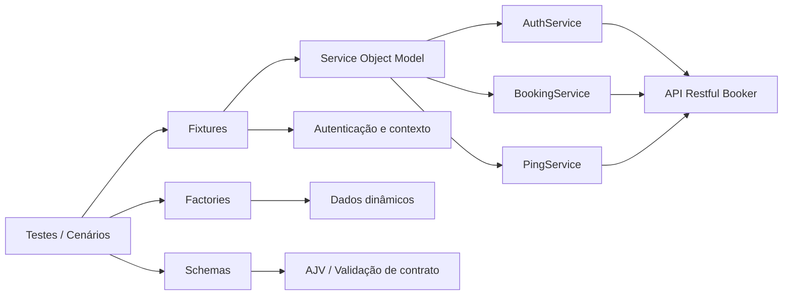

# Playwright API Automation - Restful Booker

[](https://playwright.dev/)
[](https://nodejs.org/)
[](https://github.com/features/actions)
[](https://ajv.js.org/)
[](https://fakerjs.dev/)

Este projeto é uma suíte de automação de testes de API REST desenvolvida com Playwright Test para validar a API pública [Restful Booker](https://restful-booker.herokuapp.com).

Ele foi estruturado para demonstrar mais do que execução de testes: a proposta aqui é evidenciar arquitetura de automação, qualidade de software, validação de contrato, organização em camadas e capacidade de manter uma base de testes escalável e reutilizável.

## Sumário

- [Visão geral](#visão-geral)
- [Objetivos do projeto](#objetivos-do-projeto)
- [Arquitetura da solução](#arquitetura-da-solução)
- [Estratégia de testes](#estratégia-de-testes)
- [Cobertura de testes](#cobertura-de-testes)
- [Validação de contrato](#validação-de-contrato)
- [Estrutura do repositório](#estrutura-do-repositório)
- [Tags de execução](#tags-de-execução)
- [Como executar](#como-executar)
- [Relatório HTML e CI/CD](#relatório-html-e-cicd)
- [Competências demonstradas](#competências-demonstradas)

## Visão geral

O objetivo principal deste projeto é automatizar a validação de endpoints REST focando em:

- integridade funcional;
- regras de negócio;
- autenticação e autorização;
- contratos de resposta;
- cenários de erro e regressão;
- manutenção de testes com baixo acoplamento.

A solução foi pensada como uma base profissional de automação, com separação clara entre dados, comunicação HTTP e execução dos testes. Essa abordagem reduz duplicação de código, facilita manutenção e torna a suíte mais apropriada para crescimento e evolução.

## Objetivos do projeto

- Validar os principais endpoints da API Restful Booker.
- Cobrir operações de criação, consulta, atualização e remoção de reservas.
- Garantir que status codes, payloads e regras de negócio sejam validados de forma consistente.
- Testar autenticação por cookie e Basic Auth.
- Validar contratos de resposta com JSON Schema e AJV.
- Gerar dados dinâmicos e realistas com Faker.js.
- Organizar a automação em camadas para facilitar manutenção e escalabilidade.
- Manter documentação funcional em BDD com Gherkin.
- Integrar a execução em pipeline de CI/CD no GitHub Actions.

## Arquitetura da solução

A arquitetura do projeto foi organizada em camadas com foco em separação de responsabilidades, seguindo o conceito de Service Object Model, em que cada serviço representa uma unidade de negócio ou domínio da API e encapsula a interação com o endpoint correspondente.

Esse padrão é essencial para manter a automação escalável, reutilizável e de fácil manutenção. Em vez de espalhar chamadas HTTP diretamente nos testes, o projeto centraliza a lógica de acesso à API em objetos especializados, deixando os cenários focados em comportamento e validação.



### Service Object Model aplicado no projeto

O padrão Service Object Model foi adotado para modelar a API como objetos de serviço, cada um responsável por um conjunto de operações do domínio.

- [services/auth.service.js](services/auth.service.js): concentra operações relacionadas a autenticação, como login e geração de headers de autenticação.
- [services/booking.service.js](services/booking.service.js): encapsula operações de criação, consulta, atualização e exclusão de reservas.
- [services/ping.service.js](services/ping.service.js): centraliza a verificação de disponibilidade da API.

Essa abordagem oferece diversos benefícios:

- reduz duplicação de código entre testes;
- facilita manutenção quando endpoints ou headers mudam;
- melhora a legibilidade do código;
- separa a camada de acesso à API da camada de validação e comportamento;
- deixa a suíte mais escalável para novos cenários e novos módulos.

### Camadas principais

#### Services

A pasta [services](services) concentra a lógica de comunicação com a API. Essa camada encapsula:

- métodos HTTP;
- endpoints;
- headers;
- payloads;
- autenticação;
- parâmetros de consulta.

Exemplos principais:

- [services/auth.service.js](services/auth.service.js)
- [services/booking.service.js](services/booking.service.js)
- [services/ping.service.js](services/ping.service.js)

Essa abordagem centraliza o acesso externo e evita que os testes fiquem acoplados diretamente à API.

#### Factories

A pasta [support/factories](support/factories) é responsável pela criação de dados de teste. Ela gera payloads válidos, inválidos e parcialmente preenchidos, além de filtros de busca e dados dinâmicos.

Principais arquivos:

- [support/factories/booking-factory.js](support/factories/booking-factory.js)
- [support/factories/auth-factory.js](support/factories/auth-factory.js)

Esse padrão melhora a leitura dos testes e reduz a repetição manual de payloads.

#### Fixtures

A pasta [support/fixtures](support/fixtures) define objetos reutilizáveis para os testes. A fixture [support/fixtures/api.fixture.js](support/fixtures/api.fixture.js) disponibiliza serviços e valida a disponibilidade da API antes da execução dos cenários.

Esse mecanismo ajuda a manter o ambiente de teste consistente e reutilizável.

#### Schemas e validação

Os contratos de resposta são definidos em JSON Schema, e a validação é centralizada em [support/utils/schema-validator.js](support/utils/schema-validator.js).

Arquivos de schema:

- [support/schemas/create-booking-schema.js](support/schemas/create-booking-schema.js)
- [support/schemas/check-booking-schema.js](support/schemas/check-booking-schema.js)
- [support/schemas/update-booking-schema.js](support/schemas/update-booking-schema.js)
- [support/schemas/partial-update-booking-schema.js](support/schemas/partial-update-booking-schema.js)

Essa camada garante que a API seja validada não apenas pelo status code, mas também pela estrutura e integridade dos dados retornados.

#### Testes e BDD

A pasta [tests/api](tests/api) organiza os cenários por domínio funcional, como autenticação, reservas e health check. Já a pasta [features](features) mantém a documentação comportamental em Gherkin, alinhando os requisitos com a automação.

Esse modelo demonstra maturidade na organização do projeto, pois combina documentação, execução e verificação em um mesmo fluxo.

## Estratégia de testes

A estratégia foi pensada para equilibrar cobertura funcional, qualidade de manutenção e consistência do processo de implementação.

Além da arquitetura técnica, o projeto também incorpora governança de escrita de cenários por meio do arquivo [.github/copilot-instructions.md](.github/copilot-instructions.md). Essa convenção define regras para criação de cenários Gherkin, padronização de tags, uso de linguagem em português, estrutura do BDD e separação clara entre intenção de teste e geração de payloads.

Esse tipo de orientação é especialmente relevante em fluxos com IA assistida, porque ajuda a manter a suíte consistente, legível e alinhada com boas práticas de QA, mesmo em cenários de colaboração com ferramentas de geração de código e automação.

Os testes usam a estrutura BDD em etapas:

- Given: preparação dos dados e pré-condições.
- When: realização da requisição HTTP.
- Then: validação do status code e da resposta.
- And: validações complementares de regras de negócio e contrato.

A suíte cobre:

- cenários positivos e negativos;
- testes funcionais e de regressão;
- testes de contrato;
- autenticação e autorização;
- validação de payloads e regras de negócio;
- geração dinâmica de dados;
- execução seletiva por categoria.

## Cobertura de testes

### Health Check

| Método | Endpoint | Cobertura                                            |
| ------ | -------- | ---------------------------------------------------- |
| GET    | /ping    | Disponibilidade da API e validação de status inicial |

### Autenticação

| Método | Endpoint | Cobertura                                                   |
| ------ | -------- | ----------------------------------------------------------- |
| POST   | /auth    | Login válido, credenciais inválidas e validação de contrato |

### Reservas

| Método | Endpoint      | Cobertura                                       |
| ------ | ------------- | ----------------------------------------------- |
| GET    | /booking      | Listagem e filtros por nome, sobrenome e datas  |
| GET    | /booking/{id} | Consulta por identificador e validação de erros |
| POST   | /booking      | Criação válida, payload inválido e contrato     |
| PUT    | /booking/{id} | Atualização completa e autenticação             |
| PATCH  | /booking/{id} | Atualização parcial e preservação de dados      |
| DELETE | /booking/{id} | Exclusão e confirmação da remoção               |

## Validação de contrato

A validação de contrato é uma parte essencial do projeto. Em vez de validar somente o código HTTP, a aplicação também confirma que a estrutura da resposta está alinhada com o comportamento esperado da API.

A validação abrange:

- tipos dos campos;
- campos obrigatórios;
- formatos de data;
- estrutura de objetos;
- presença de propriedades esperadas;
- rejeição de payloads inconsistentes.

Essa abordagem é importante porque deixa o projeto mais próximo de um cenário real de qualidade em API, com foco em confiabilidade e robustez do contrato.

## Estrutura do repositório

```text
.
├── .github/
│   ├── copilot-instructions.md
│   └── workflows/
│       └── playwright.yml
├── features/
│   ├── auth.feature
│   ├── booking-creation.feature
│   ├── booking-deletion.feature
│   ├── booking-details.feature
│   ├── booking-list.feature
│   ├── booking-partial-update.feature
│   ├── booking-update.feature
│   └── ping.feature
├── services/
│   ├── auth.service.js
│   ├── booking.service.js
│   └── ping.service.js
├── support/
│   ├── factories/
│   │   ├── auth-factory.js
│   │   └── booking-factory.js
│   ├── fixtures/
│   │   └── api.fixture.js
│   ├── schemas/
│   └── utils/
│       └── schema-validator.js
├── tests/
│   └── api/
│       ├── auth/
│       ├── booking/
│       └── ping/
├── package.json
├── playwright.config.js
├── .gitignore
├── README.md
└── playwright-report/
```

## Tags de execução

- @smoke: cenários críticos e de validação rápida.
- @funcional: regras funcionais da API.
- @contrato: avaliações estruturais das respostas.
- @excecao: fluxos negativos e erros esperados.
- @seguranca: autenticação e autorização.

## Como executar

### Pré-requisitos

- Node.js LTS ou superior
- npm
- acesso à internet
- disponibilidade da API Restful Booker

### Instalação

```bash
npm ci
npx playwright install
```

Em ambientes Linux de CI, pode ser necessário:

```bash
npx playwright install --with-deps
```

### Executar a suíte completa

```bash
npm run test:api
```

### Executar por área

```bash
npm run test:auth
npm run test:booking
npm run test:ping
```

### Executar por categoria

```bash
npm run test:smoke
npm run test:funcional
npm run test:contrato
npm run test:excecao
npm run test:seguranca
```

### Executar um arquivo específico

```bash
npx playwright test tests/api/booking/booking-creation.spec.js
```

### Modo interativo e debug

```bash
npx playwright test --ui
npx playwright test --debug
```

## Relatório HTML e CI/CD

O projeto gera relatório HTML do Playwright, permitindo análise visual de execução, falhas, traces e evidências de teste.

O relatório pode ser visualizado localmente com:

```bash
npx playwright show-report
```

O pipeline de integração contínua está configurado em [.github/workflows/playwright.yml](.github/workflows/playwright.yml) e executa a suíte em eventos de push e pull request para a branch principal.

A pipeline inclui:

1. checkout do código;
2. configuração do Node.js;
3. instalação das dependências;
4. execução dos testes;
5. publicação do relatório HTML como artifact;
6. publicação do relatório HTML no GitHub Pages após pushes na branch principal;
7. retenção de evidências para investigação posterior.

### Relatório no GitHub Pages

Após a execução do workflow em um `push` para `main`, o relatório fica disponível na URL de Pages do repositório, normalmente:

```text
https://mateus-f.github.io/playwright-restful-booker-api/
```

Em pull requests, o workflow gera o artifact do relatório sem publicar uma versão no Pages. O deploy utiliza **GitHub Actions** como fonte de publicação do ambiente **GitHub Pages**.

## Competências demonstradas

- Automação de testes de API REST com Playwright.
- Testes funcionais e de regressão.
- Testes de contrato com JSON Schema e AJV.
- Validação de autenticação e autorização.
- Geração de dados dinâmicos com Faker.
- Estrutura de automação em camadas.
- Organização por domínios e responsabilidades.
- Reuso de fixtures e serviços.
- Documentação funcional em Gherkin/BDD.
- Execução automatizada via GitHub Actions.
- Produção de relatórios e evidências de qualidade.
- Pensamento orientado a manutenção e escalabilidade.
